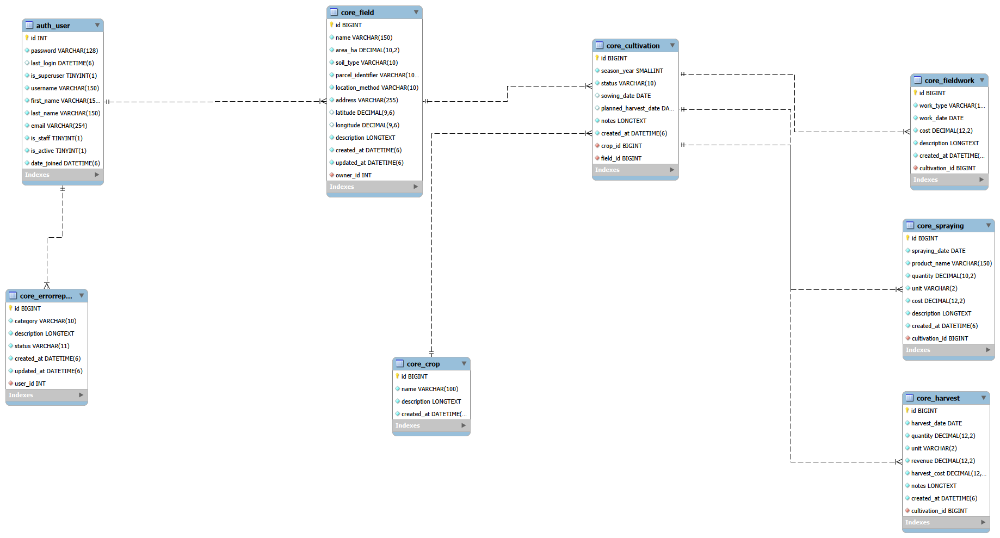

# Farmer App

Farmer App to studencka aplikacja internetowa dla właścicieli i osób zarządzających gospodarstwami rolnymi. Pozwala prowadzić ewidencję pól i sezonowych upraw, zapisywać wykonane zabiegi oraz zbiory, a następnie obliczać koszty, przychody i wynik finansowy. Wspólny katalog rodzajów upraw może uzupełniać każdy zalogowany użytkownik, a administrator edytuje i usuwa jego pozycje oraz obsługuje statusy zgłoszeń przez panel Django Admin.

## Funkcje

- rejestracja, logowanie i bezpieczne wylogowanie przez POST;
- profil użytkownika, edycja danych i zmiana hasła z zachowaniem sesji;
- CRUD własnych pól, upraw sezonowych, prac, oprysków i zbiorów;
- wspólny katalog „Rodzaje upraw” z możliwością dodawania nowych pozycji przez zalogowanych użytkowników;
- sezony upraw z zakresu lat 1980–2100;
- wyszukiwanie, filtry oraz paginacja list;
- raport gospodarstwa, pola i uprawy z ilością zbiorów, stratami, kosztami, przychodami i zyskiem;
- rozróżnienie zbiorów sprzedanych, magazynowanych oraz zutylizowanych;
- zgłaszanie błędów i podgląd własnych zgłoszeń;
- edycja i usuwanie rodzajów upraw oraz obsługa statusów zgłoszeń w Django Admin;
- uwierzytelnianie JWT dla klientów API z tokenami access i refresh (z limitem żądań);
- blokada logowania po 5 nieudanych próbach (15 minut, per IP i nazwa użytkownika);
- jasny i ciemny motyw z przełącznikiem w nagłówku;
- idempotentna komenda przygotowująca dane demonstracyjne;
- izolacja danych każdego właściciela oraz testy bezpieczeństwa.

## Technologie

- Python 3.14.6;
- Django 6.0.7;
- Django REST Framework 3.18.1 i SimpleJWT 5.5.1;
- MySQL Server 8.0.46 i MySQL Workbench;
- SQLite jako opcjonalna baza lokalna i baza testowa;
- mysqlclient 2.2.8;
- python-dotenv 1.2.3.

Dokładne wersje zależności są zapisane w [`requirements.txt`](requirements.txt).

## Dlaczego MySQL i SQLite

Projekt nie korzysta z obu baz jednocześnie. W danym uruchomieniu aktywny jest zawsze tylko jeden silnik:

- **MySQL** jest docelową bazą aplikacji i środowiska wdrożeniowego;
- **SQLite** służy do lokalnego uruchamiania oraz izolowanych testów automatycznych;
- aktywny silnik wybiera zmienna `DB_ENGINE` (`mysql` lub `sqlite`; brak wartości oznacza SQLite);
- oba silniki korzystają z tych samych modeli i migracji Django;
- dane nie są zapisywane równocześnie do obu baz ani między nimi synchronizowane.

## Struktura repozytorium

```text
farmer-app-main/
├── config/                       # ustawienia projektu i główne trasy
├── core/
│   ├── management/commands/      # seed_demo_data
│   ├── migrations/               # migracje aplikacji
│   ├── services/                 # agregacje raportów finansowych
│   ├── static/core/              # style CSS i skrypty motywu
│   ├── templates/core/           # proste szablony Django
│   ├── tests/                    # testy modeli, widoków, API i bezpieczeństwa
│   ├── forms.py, views.py        # formularze i widoki
│   └── api_views.py              # chronione endpointy API
├── docs/
│   ├── database/                 # eksport schematu SQL
│   ├── diagrams/                 # ERD i model Workbench
│   └── dokumentacja_bazy_danych.md
├── .env.example
├── manage.py
└── requirements.txt
```

## Dokumentacja i diagramy

- [Dokumentacja bazy danych](docs/dokumentacja_bazy_danych.md)
- [Diagram ERD](docs/diagrams/erd_farmer_app.png)
- [Model MySQL Workbench](docs/diagrams/farmer_db_model.mwb)
- [Eksport schematu SQL](docs/database/farmer_db_schema.sql)



## Sezony upraw

- rok sezonu musi mieścić się w zakresie 1980–2100 (walidacja w modelu i formularzu);
- rok daty siewu musi odpowiadać rokowi sezonu;
- planowana data zbioru nie może być wcześniejsza od daty siewu, ale może przypadać na następny rok (np. uprawy ozime);
- filtry roku sezonu na listach i w raportach bezpiecznie obsługują nieprawidłowe wartości — nie powodują błędu serwera; lista upraw pomija taki filtr, a raporty wyświetlają komunikat o nieprawidłowym filtrze.

## Rodzaje upraw

| Ścieżka | Nazwa trasy | Opis |
| --- | --- | --- |
| `/crops/` | `core:crop_list` | lista rodzajów upraw, dostępna po zalogowaniu |
| `/crops/add/` | `core:crop_create` | dodawanie nowego rodzaju uprawy |

- katalog jest wspólny dla wszystkich użytkowników i nie należy do konkretnego właściciela;
- zwykły użytkownik może dodawać pozycje, ale nie może ich edytować ani usuwać;
- edycja i usuwanie rodzajów upraw pozostają w panelu Django Admin;
- duplikaty nazw są wykrywane bez uwzględniania wielkości liter, również dla polskich znaków (np. „Łubin” i „łubin”).

## Jasny i ciemny motyw

- przełącznik motywu znajduje się w nagłówku i działa na wszystkich stronach aplikacji korzystających z `base.html`, również bez logowania;
- przy pierwszej wizycie motyw jest zgodny z ustawieniem systemowym `prefers-color-scheme`;
- ręczny wybór jest zapisywany w `localStorage`; gdy pamięć przeglądarki jest niedostępna, używany jest motyw systemowy;
- motyw jest ustawiany przed załadowaniem arkusza stylów, co zapobiega mignięciu niewłaściwych kolorów;
- uwzględniono dostępność: etykiety przycisku i komunikat dla czytników ekranu, kontrast kolorów w obu motywach, widoczny focus klawiatury (`:focus-visible`) oraz ograniczenie animacji przy `prefers-reduced-motion`;
- wygląd panelu Django Admin nie jest zmieniany.

## Instalacja na Windows PowerShell

```powershell
python --version
python -m venv .venv
Set-ExecutionPolicy -Scope Process -ExecutionPolicy Bypass
.\.venv\Scripts\Activate.ps1
python -m pip install --upgrade pip
python -m pip install -r requirements.txt
Copy-Item .env.example .env
```

Jeśli nie chcesz aktywować środowiska, używaj `.\.venv\Scripts\python.exe` zamiast `python`. Lokalny `.env` trzeba uzupełnić przed uruchomieniem Django; plik jest ignorowany przez Git.

## Konfiguracja `.env`

W obu wariantach ustaw własny, długi i losowy `DJANGO_SECRET_KEY`. Nie kopiuj przykładowych haseł do środowiska produkcyjnego.

SQLite:

```dotenv
DJANGO_SECRET_KEY=change-me-to-a-long-random-value
DJANGO_DEBUG=True
DJANGO_ALLOWED_HOSTS=localhost,127.0.0.1,[::1]
DB_ENGINE=sqlite
```

MySQL:

```dotenv
DJANGO_SECRET_KEY=change-me-to-a-long-random-value
DJANGO_DEBUG=True
DJANGO_ALLOWED_HOSTS=localhost,127.0.0.1,[::1]
DB_ENGINE=mysql
DB_NAME=farmer_db
DB_USER=farmer_app_user
DB_PASSWORD=change-me
DB_HOST=localhost
DB_PORT=3306
```

Domyślnie (bez zmiennej) `DJANGO_DEBUG` ma wartość `False`; lokalnie ustaw `DJANGO_DEBUG=True` w `.env`. `DJANGO_DEBUG=False` należy stosować poza środowiskiem deweloperskim. `DJANGO_ALLOWED_HOSTS` jest listą nazw oddzielonych przecinkami. Gdy `DB_ENGINE` nie ma wartości `mysql`, aplikacja korzysta z SQLite.

## Przygotowanie MySQL

Poniższe polecenia wykonaj jako administrator MySQL, zastępując przykładowe hasło:

```sql
CREATE DATABASE farmer_db CHARACTER SET utf8mb4 COLLATE utf8mb4_unicode_ci;
CREATE USER 'farmer_app_user'@'localhost' IDENTIFIED BY 'change-me-strong-password';
GRANT ALL PRIVILEGES ON farmer_db.* TO 'farmer_app_user'@'localhost';
FLUSH PRIVILEGES;
```

Aplikacja powinna używać dedykowanego konta `farmer_app_user`, a nie `root`.

## Migracje i pierwsze uruchomienie

```powershell
python manage.py check
python manage.py migrate
python manage.py createsuperuser
python manage.py runserver --noreload
```

Aplikacja działa pod `http://127.0.0.1:8000/`, a panel administratora pod `http://127.0.0.1:8000/admin/`.

```powershell
python manage.py makemigrations --check --dry-run
python manage.py showmigrations
python manage.py sqlmigrate core 0001
```

Aplikacja `core` ma obecnie trzy migracje:

- `0001_initial` — początkowa struktura tabel;
- `0002_harvest_disposition_and_more` — pole przeznaczenia zbioru (`disposition`) oraz ograniczenie zerowego przychodu dla zbiorów niesprzedanych;
- `0003_alter_cultivation_season_year` — aktualizacja walidatorów roku sezonu do zakresu 1980–2100; zmienia jedynie walidację na poziomie Django, a nie strukturę tabel.

## Dane demonstracyjne

Komenda wymaga istniejącego użytkownika i nie tworzy konta ani hasła:

```powershell
python manage.py seed_demo_data --username admin
```

Tworzy lub aktualizuje rodzaje upraw, dwa pola, uprawy sezonu 2026, prace, opryski i zbiory. Ponowne uruchomienie dla tego samego użytkownika nie duplikuje danych.

## Uwierzytelnianie JWT

JWT działa równolegle ze zwykłymi sesjami używanymi przez strony HTML i panel
administracyjny. Dostępne endpointy:

- `POST /api/auth/token/` — wydanie tokenów `access` i `refresh` na podstawie nazwy użytkownika i hasła;
- `POST /api/auth/token/refresh/` — wydanie nowego tokenu `access`;
- `POST /api/auth/token/verify/` — sprawdzenie poprawności tokenu;
- `GET /api/auth/me/` — dane aktualnego użytkownika, wymagany nagłówek `Authorization: Bearer <access>`.

Token `access` jest ważny 15 minut, a `refresh` jeden dzień. Przykładowe pobranie
tokenów w PowerShell:

```powershell
$body = @{username = "admin"; password = "twoje-haslo"} | ConvertTo-Json
$tokens = Invoke-RestMethod -Method Post `
    -Uri http://127.0.0.1:8000/api/auth/token/ `
    -ContentType "application/json" -Body $body
```

## Testy na SQLite

```powershell
$env:DB_ENGINE = "sqlite"
python manage.py check
python manage.py makemigrations --check --dry-run
python manage.py test
Remove-Item Env:DB_ENGINE
```

Wszystkie testy znajdują się w osobnym pakiecie `core/tests/`. Wyłącznie testy
JWT można uruchomić poleceniem:

```powershell
python manage.py test core.tests.test_jwt_auth
```

Django tworzy oddzielną bazę testową i usuwa ją po zakończeniu testów. Przy testach bezpośrednio na MySQL konto bazy musi zwykle mieć uprawnienie `CREATE`, ponieważ Django tworzy tymczasową bazę z prefiksem `test_`. Zalecanym wariantem lokalnym pozostaje SQLite.

## Workflow Git

```powershell
git switch -c feature/nazwa-zadania
git status
git add <sprawdzone-pliki>
git commit -m "Krótki opis zmiany"
git push -u origin feature/nazwa-zadania
```

Przed scaleniem uruchom pełne testy, `git diff --check` i sprawdź konflikty. `.env`, `db.sqlite3`, `.venv` i dane uwierzytelniające nie mogą trafić do commita. Nazwa gałęzi bazowej i sposób tworzenia pull requestu powinny być zgodne z zasadami zespołu.

## Bezpieczeństwo

- dane gospodarstwa są filtrowane według zalogowanego właściciela;
- cudze obiekty zwracają 404, a relacje w formularzach mają ograniczone querysety;
- formularze POST korzystają z CSRF, wylogowanie i właściwe usuwanie nie odbywają się przez GET;
- hasła są walidowane i hashowane przez Django, a nie przechowywane jawnie;
- `SECRET_KEY`, ustawienia MySQL, `DEBUG` i `ALLOWED_HOSTS` pochodzą ze środowiska;
- na produkcji należy uruchomić także `python manage.py check --deploy` i skonfigurować HTTPS.

## Autorzy

- Daniil Stavytskyi / numer albumu: 102342;
- Tsimafei Zelianeuski / numer albumu: 102338;
- Dzmitry Marchuk / numer albumu: 102340;
- Prowadzący: Fabian Bogusławski.
