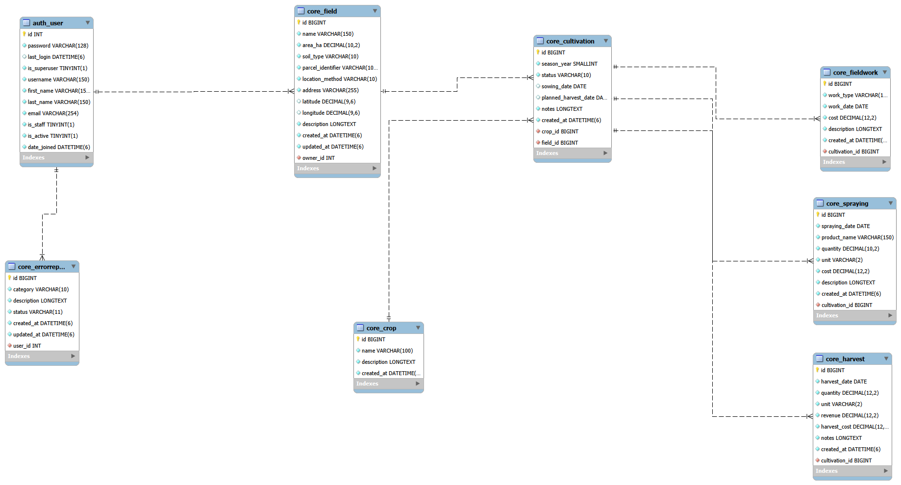

# Dokumentacja bazy danych – Farmer App

## 1. Cel bazy danych

Baza danych Farmer App służy do przechowywania informacji potrzebnych do zarządzania gospodarstwem rolnym. Głównymi użytkownikami systemu są właściciele i osoby zarządzające gospodarstwami. Każdy użytkownik może ewidencjonować własne pola, prowadzone na nich uprawy w kolejnych sezonach, wykonane prace polowe, opryski, zbiory, koszty oraz przychody. System przechowuje także słownik rodzajów upraw i zgłoszenia błędów użytkowników.

Model danych pozwala powiązać wszystkie zdarzenia produkcyjne z konkretną uprawą, polem i właścicielem. Stanowi to podstawę do późniejszego tworzenia zestawień kosztów, przychodów i rentowności gospodarstwa.

## 2. Zastosowane technologie

- Python 3.14.6;
- Django 6.0.7;
- MySQL Server 8.0.46;
- MySQL Workbench do modelowania, administracji, eksportu i importu danych;
- mysqlclient 2.2.8 jako sterownik MySQL dla Django;
- python-dotenv 1.2.3 do wczytywania konfiguracji z pliku `.env`;
- SQLite jako opcjonalna, domyślna baza lokalna i baza używana w testach.

Pozostałe przypięte zależności to: asgiref 3.12.1, sqlparse 0.6.0 i tzdata 2026.3. Dokładny zestaw znajduje się w pliku [`requirements.txt`](../requirements.txt).

## 3. Diagram ERD



Oznaczenia na diagramie:

- **PK (Primary Key)** – klucz główny jednoznacznie identyfikujący rekord; w tabelach aplikacji jest to automatycznie generowane pole `id`;
- **FK (Foreign Key)** – klucz obcy wskazujący rekord w innej tabeli, np. `owner_id` wskazuje `auth_user.id`;
- **UNIQUE** – wartość albo zestaw wartości nie może się powtarzać;
- **1:N** – jednemu rekordowi po stronie „1” może odpowiadać wiele rekordów po stronie „N”, natomiast każdy rekord po stronie „N” wskazuje dokładnie jeden rekord nadrzędny.

Diagram przedstawia tabele i relacje wynikające z modelu Django. Szczegółowe, nazwane ograniczenia `CHECK` i złożone ograniczenia `UNIQUE` są zdefiniowane w migracji i opisane w dalszych sekcjach.

## 4. Opis tabel

W kolumnie „Wymagane” słowo „Nie” oznacza, że model dopuszcza `NULL` albo pustą wartość (`blank=True`). Pola tekstowe z `blank=True` są w bazie zwykle `NOT NULL`, ale mogą zawierać pusty ciąg znaków. Wszystkie niewymienione jako opcjonalne pola są wymagane przez model.

### 4.1. Tabela `auth_user`

Standardowa tabela użytkowników Django. Projekt korzysta z `settings.AUTH_USER_MODEL` i nie definiuje własnego modelu użytkownika.

| Nazwa pola | Typ danych | Wymagane | Klucz lub ograniczenie | Opis |
|---|---|---:|---|---|
| `id` | INT, auto increment | Tak | PK | Identyfikator użytkownika. |
| `password` | VARCHAR(128) | Tak | — | Skrót hasła wraz z informacją o algorytmie; nie jest to hasło jawne. |
| `last_login` | DATETIME(6) | Nie | NULL | Data i czas ostatniego logowania. |
| `is_superuser` | BOOLEAN / TINYINT(1) | Tak | — | Informacja o pełnych uprawnieniach użytkownika. |
| `username` | VARCHAR(150) | Tak | UNIQUE | Unikalna nazwa użytkownika. |
| `first_name` | VARCHAR(150) | Nie | pusty ciąg dozwolony | Imię. |
| `last_name` | VARCHAR(150) | Nie | pusty ciąg dozwolony | Nazwisko. |
| `email` | VARCHAR(254) | Nie | pusty ciąg dozwolony | Adres e-mail. |
| `is_staff` | BOOLEAN / TINYINT(1) | Tak | — | Dostęp do panelu administracyjnego. |
| `is_active` | BOOLEAN / TINYINT(1) | Tak | — | Aktywność konta. |
| `date_joined` | DATETIME(6) | Tak | — | Data i czas utworzenia konta. |

Tabela `auth_user` ma również standardowe relacje Django z tabelami grup i uprawnień, które nie są częścią domenowego diagramu Farmer App.

### 4.2. Tabela `core_crop`

Słownik rodzajów upraw.

| Nazwa pola | Typ danych | Wymagane | Klucz lub ograniczenie | Opis |
|---|---|---:|---|---|
| `id` | BIGINT, auto increment | Tak | PK | Identyfikator rodzaju uprawy. |
| `name` | VARCHAR(100) | Tak | UNIQUE | Unikalna nazwa, np. „Pszenica”. |
| `description` | LONGTEXT | Nie | pusty ciąg dozwolony | Opcjonalny opis rodzaju uprawy. |
| `created_at` | DATETIME(6) | Tak | `auto_now_add` | Data i czas utworzenia rekordu. |

Domyślne sortowanie: rosnąco według `name`.

### 4.3. Tabela `core_field`

Rejestr pól rolnych należących do użytkowników.

| Nazwa pola | Typ danych | Wymagane | Klucz lub ograniczenie | Opis |
|---|---|---:|---|---|
| `id` | BIGINT, auto increment | Tak | PK | Identyfikator pola. |
| `owner_id` | INT | Tak | FK → `auth_user.id`, CASCADE; UNIQUE z `name` | Właściciel pola. |
| `name` | VARCHAR(150) | Tak | UNIQUE z `owner_id` | Nazwa pola w ramach konta właściciela. |
| `area_ha` | DECIMAL(10,2) | Tak | CHECK `area_ha > 0` | Powierzchnia pola w hektarach. |
| `soil_type` | VARCHAR(10) | Tak | wybór Django | Kod gleby: `SANDY`, `CLAY`, `LOAMY`, `SILT`, `PEAT` lub `OTHER`. |
| `parcel_identifier` | VARCHAR(100) | Nie | pusty ciąg dozwolony | Identyfikator działki ewidencyjnej. |
| `location_method` | VARCHAR(10) | Tak | wybór Django | Metoda lokalizacji: `ADDRESS`, `GPS`, `MAP` albo `PARCEL`. |
| `address` | VARCHAR(255) | Nie | pusty ciąg dozwolony | Adres opisowy pola. |
| `latitude` | DECIMAL(9,6) | Nie | NULL; walidator −90…90 | Szerokość geograficzna. |
| `longitude` | DECIMAL(9,6) | Nie | NULL; walidator −180…180 | Długość geograficzna. |
| `description` | LONGTEXT | Nie | pusty ciąg dozwolony | Dodatkowy opis pola. |
| `created_at` | DATETIME(6) | Tak | `auto_now_add` | Data i czas utworzenia. |
| `updated_at` | DATETIME(6) | Tak | `auto_now` | Data i czas ostatniej aktualizacji. |

Ograniczenie `core_field_unique_owner_name` zapewnia unikalność pary (`owner_id`, `name`), a `core_field_area_ha_gt_zero` wymusza dodatnią powierzchnię. Domyślne sortowanie: według `name`.

### 4.4. Tabela `core_cultivation`

Uprawa konkretnego rodzaju prowadzona na konkretnym polu w danym sezonie.

| Nazwa pola | Typ danych | Wymagane | Klucz lub ograniczenie | Opis |
|---|---|---:|---|---|
| `id` | BIGINT, auto increment | Tak | PK | Identyfikator uprawy sezonowej. |
| `field_id` | BIGINT | Tak | FK → `core_field.id`, CASCADE; część UNIQUE | Pole, na którym prowadzona jest uprawa. |
| `crop_id` | BIGINT | Tak | FK → `core_crop.id`, PROTECT; część UNIQUE | Rodzaj uprawy. |
| `season_year` | SMALLINT UNSIGNED | Tak | walidatory 2000…2100; część UNIQUE | Rok sezonu. |
| `status` | VARCHAR(10) | Tak | wybór Django | `PLANNED`, `ACTIVE` albo `COMPLETED`. |
| `sowing_date` | DATE | Nie | NULL | Data siewu. |
| `planned_harvest_date` | DATE | Nie | NULL; walidacja względem `sowing_date` | Planowana data zbioru. |
| `notes` | LONGTEXT | Nie | pusty ciąg dozwolony | Notatki dotyczące uprawy. |
| `created_at` | DATETIME(6) | Tak | `auto_now_add` | Data i czas utworzenia. |

Ograniczenie `core_cultivation_unique_field_crop_season` zapewnia unikalność trójki (`field_id`, `crop_id`, `season_year`). Domyślne sortowanie: malejąco po sezonie, następnie po nazwie pola i rodzaju uprawy.

### 4.5. Tabela `core_fieldwork`

Ewidencja prac wykonanych w ramach uprawy.

| Nazwa pola | Typ danych | Wymagane | Klucz lub ograniczenie | Opis |
|---|---|---:|---|---|
| `id` | BIGINT, auto increment | Tak | PK | Identyfikator pracy. |
| `cultivation_id` | BIGINT | Tak | FK → `core_cultivation.id`, CASCADE | Uprawa, której dotyczy praca. |
| `work_type` | VARCHAR(12) | Tak | wybór Django | `PLOWING`, `SOWING`, `FERTILIZING`, `WATERING`, `WEEDING` lub `OTHER`. |
| `work_date` | DATE | Tak | — | Data wykonania pracy. |
| `cost` | DECIMAL(12,2) | Tak | domyślnie 0; CHECK `cost >= 0` | Koszt pracy. |
| `description` | LONGTEXT | Nie | pusty ciąg dozwolony | Opis wykonanej pracy. |
| `created_at` | DATETIME(6) | Tak | `auto_now_add` | Data i czas utworzenia. |

Constraint bazodanowy ma nazwę `core_fieldwork_cost_gte_zero`. Domyślne sortowanie: od najnowszej daty pracy i utworzenia.

### 4.6. Tabela `core_spraying`

Ewidencja oprysków wykonanych dla uprawy.

| Nazwa pola | Typ danych | Wymagane | Klucz lub ograniczenie | Opis |
|---|---|---:|---|---|
| `id` | BIGINT, auto increment | Tak | PK | Identyfikator oprysku. |
| `cultivation_id` | BIGINT | Tak | FK → `core_cultivation.id`, CASCADE | Uprawa, której dotyczy oprysk. |
| `spraying_date` | DATE | Tak | — | Data wykonania oprysku. |
| `product_name` | VARCHAR(150) | Tak | — | Nazwa zastosowanego preparatu. |
| `quantity` | DECIMAL(10,2) | Tak | CHECK `quantity > 0` | Ilość preparatu. |
| `unit` | VARCHAR(2) | Tak | wybór Django | Jednostka: `L`, `ML`, `KG` albo `G`. |
| `cost` | DECIMAL(12,2) | Tak | domyślnie 0; CHECK `cost >= 0` | Koszt oprysku. |
| `description` | LONGTEXT | Nie | pusty ciąg dozwolony | Dodatkowy opis. |
| `created_at` | DATETIME(6) | Tak | `auto_now_add` | Data i czas utworzenia. |

Constrainty bazodanowe: `core_spraying_quantity_gt_zero` i `core_spraying_cost_gte_zero`. Domyślne sortowanie: od najnowszej daty oprysku i utworzenia.

### 4.7. Tabela `core_harvest`

Ewidencja zbiorów, przychodów i kosztów zbioru.

| Nazwa pola | Typ danych | Wymagane | Klucz lub ograniczenie | Opis |
|---|---|---:|---|---|
| `id` | BIGINT, auto increment | Tak | PK | Identyfikator zbioru. |
| `cultivation_id` | BIGINT | Tak | FK → `core_cultivation.id`, CASCADE | Uprawa, z której pochodzi zbiór. |
| `harvest_date` | DATE | Tak | — | Data zbioru. |
| `quantity` | DECIMAL(12,2) | Tak | CHECK `quantity > 0` | Zebrana ilość. |
| `unit` | VARCHAR(2) | Tak | wybór Django | Jednostka: `KG` albo `T`. |
| `revenue` | DECIMAL(12,2) | Tak | domyślnie 0; CHECK `revenue >= 0` | Przychód ze zbioru. |
| `harvest_cost` | DECIMAL(12,2) | Tak | domyślnie 0; CHECK `harvest_cost >= 0` | Koszt przeprowadzenia zbioru. |
| `notes` | LONGTEXT | Nie | pusty ciąg dozwolony | Notatki dotyczące zbioru. |
| `created_at` | DATETIME(6) | Tak | `auto_now_add` | Data i czas utworzenia. |

Constrainty bazodanowe: `core_harvest_quantity_gt_zero`, `core_harvest_revenue_gte_zero` oraz `core_harvest_cost_gte_zero`. Właściwość modelu `profit` oblicza `revenue - harvest_cost`; nie jest osobną kolumną. Domyślne sortowanie: od najnowszej daty zbioru i utworzenia.

### 4.8. Tabela `core_errorreport`

Zgłoszenia problemów przekazywane przez użytkowników.

| Nazwa pola | Typ danych | Wymagane | Klucz lub ograniczenie | Opis |
|---|---|---:|---|---|
| `id` | BIGINT, auto increment | Tak | PK | Identyfikator zgłoszenia. |
| `user_id` | INT | Tak | FK → `auth_user.id`, CASCADE | Autor zgłoszenia. |
| `category` | VARCHAR(10) | Tak | wybór Django | `TECHNICAL`, `DATA`, `INTERFACE` albo `OTHER`. |
| `description` | LONGTEXT | Tak | — | Treść zgłoszenia. |
| `status` | VARCHAR(11) | Tak | wybór Django | `NEW`, `IN_PROGRESS` albo `RESOLVED`. |
| `created_at` | DATETIME(6) | Tak | `auto_now_add` | Data i czas utworzenia. |
| `updated_at` | DATETIME(6) | Tak | `auto_now` | Data i czas ostatniej aktualizacji. |

Domyślne sortowanie: od najnowszego zgłoszenia.

## 5. Relacje

| Model i pole | Relacja | Usuwanie | `related_name` | Znaczenie |
|---|---|---|---|---|
| `Field.owner` | `auth_user` 1:N `core_field` | CASCADE | `fields` | Usunięcie użytkownika usuwa jego pola. |
| `ErrorReport.user` | `auth_user` 1:N `core_errorreport` | CASCADE | `error_reports` | Usunięcie użytkownika usuwa jego zgłoszenia. |
| `Cultivation.field` | `core_field` 1:N `core_cultivation` | CASCADE | `cultivations` | Usunięcie pola usuwa prowadzone na nim uprawy. |
| `Cultivation.crop` | `core_crop` 1:N `core_cultivation` | PROTECT | `cultivations` | Nie można usunąć rodzaju uprawy używanego przez uprawę sezonową. |
| `FieldWork.cultivation` | `core_cultivation` 1:N `core_fieldwork` | CASCADE | `works` | Usunięcie uprawy usuwa jej prace. |
| `Spraying.cultivation` | `core_cultivation` 1:N `core_spraying` | CASCADE | `sprayings` | Usunięcie uprawy usuwa jej opryski. |
| `Harvest.cultivation` | `core_cultivation` 1:N `core_harvest` | CASCADE | `harvests` | Usunięcie uprawy usuwa jej zbiory. |

## 6. Integralność i walidacja danych

Integralność jest realizowana na dwóch poziomach:

1. **Walidacja Django** działa m.in. podczas obsługi formularzy oraz po jawnym wywołaniu `full_clean()`. Zwykłe `save()` nie uruchamia automatycznie pełnej walidacji modelu.
2. **Ograniczenia bazy danych** są zapisane w migracji i egzekwowane bezpośrednio przez MySQL lub SQLite, niezależnie od sposobu zapisu rekordu.

Zastosowane reguły:

- `Field.area_ha` ma walidator minimum `0.01` oraz bazodanowy CHECK `area_ha > 0`;
- koszty `FieldWork.cost`, `Spraying.cost`, `Harvest.harvest_cost` i przychód `Harvest.revenue` mają walidatory minimum `0` oraz odpowiednie constrainty `>= 0`;
- ilości `Spraying.quantity` i `Harvest.quantity` mają walidatory minimum `0.01` oraz constrainty `> 0`;
- `latitude` ma walidatory od −90 do 90, a `longitude` od −180 do 180; migracja nie definiuje dla nich osobnych constraintów CHECK, dlatego jest to walidacja warstwy Django;
- para (`owner`, `name`) w `Field` jest unikalna dzięki `core_field_unique_owner_name`;
- trójka (`field`, `crop`, `season_year`) w `Cultivation` jest unikalna dzięki `core_cultivation_unique_field_crop_season`;
- rok sezonu ma walidatory od 2000 do 2100;
- `Cultivation.clean()` odrzuca planowaną datę zbioru wcześniejszą od daty siewu; migracja nie zawiera constraintu dat, więc zapis omijający walidację Django nie jest przez bazę chroniony przed taką kolejnością;
- wartości `TextChoices` są sprawdzane przez Django, ale w migracji nie ma dla nich osobnych constraintów CHECK;
- `Crop` używany przez `Cultivation` jest chroniony przez `on_delete=PROTECT`.

MySQL 8.0.46 egzekwuje nazwane ograniczenia CHECK utworzone przez migrację. Klucze obce i ograniczenia UNIQUE są także wykonywane bezpośrednio przez silnik bazy.

## 7. Bezpieczeństwo

- Django przechowuje hasła jako bezpieczne skróty utworzone przez skonfigurowane mechanizmy haszowania, a nie jako tekst jawny.
- Aplikacja powinna łączyć się z MySQL jako dedykowany użytkownik `farmer_app_user`, nie jako administracyjne konto `root`.
- `SECRET_KEY`, tryb debugowania i dane dostępowe do MySQL są pobierane ze zmiennych środowiskowych ładowanych przez `python-dotenv`.
- Lokalny `.env` jest ignorowany przez Git. Repozytorium zawiera wyłącznie `.env.example` z wartościami przykładowymi.
- Relacja `Field.owner` pozwala przypisywać dane do właściciela. Przyszłe widoki/API muszą wymuszać autoryzację i filtrować rekordy po zalogowanym użytkowniku (np. `owner=request.user`); obecna warstwa modeli nie zapewnia automatycznie uprawnień obiektowych.
- W repozytorium nie należy umieszczać prawdziwych haseł, kluczy ani kopii produkcyjnego `.env`.
- W środowisku produkcyjnym `DJANGO_DEBUG` powinno mieć wartość `False`, a `DJANGO_SECRET_KEY` powinien być długą, losową wartością.

## 8. Konfiguracja MySQL

Poniższe polecenia należy wykonać z konta administratora MySQL. Hasło jest wyłącznie przykładem i przed użyciem musi zostać zastąpione silnym hasłem, zapisanym tylko w lokalnym `.env`.

```sql
CREATE DATABASE farmer_db
    CHARACTER SET utf8mb4
    COLLATE utf8mb4_unicode_ci;

CREATE USER 'farmer_app_user'@'localhost'
    IDENTIFIED BY 'change-me-strong-password';

GRANT ALL PRIVILEGES ON farmer_db.*
    TO 'farmer_app_user'@'localhost';

FLUSH PRIVILEGES;
```

Konfiguracja Django ustawia dla połączenia `OPTIONS = {"charset": "utf8mb4"}`. Jeżeli aplikacja i MySQL działają na różnych hostach, należy świadomie zmienić host konta i ograniczyć dostęp regułami sieciowymi.

## 9. Konfiguracja projektu

Polecenia dla PowerShell w systemie Windows:

```powershell
python -m venv .venv
.\.venv\Scripts\Activate.ps1
python -m pip install -r requirements.txt
Copy-Item .env.example .env
```

Następnie należy uzupełnić lokalny `.env` właściwymi wartościami:

```dotenv
DJANGO_SECRET_KEY=change-me
DJANGO_DEBUG=True
DB_ENGINE=mysql
DB_NAME=farmer_db
DB_USER=farmer_app_user
DB_PASSWORD=change-me
DB_HOST=localhost
DB_PORT=3306
```

Po utworzeniu bazy i użytkownika MySQL:

```powershell
python manage.py migrate
python manage.py createsuperuser
python manage.py seed_demo_data --username admin
python manage.py runserver --noreload
```

`seed_demo_data` wymaga, aby użytkownik wskazany przez `--username` już istniał. Komenda nie tworzy użytkownika ani hasła.

Jeśli `DB_ENGINE` nie ma wartości `mysql`, ustawienia Django wybierają lokalną bazę SQLite `db.sqlite3`.

## 10. Migracje

- `python manage.py makemigrations` analizuje zmiany modeli i tworzy nowe pliki migracji; nie zmienia jeszcze schematu bazy;
- `python manage.py migrate` wykonuje niewykonane migracje na aktualnie skonfigurowanej bazie;
- `python manage.py showmigrations` pokazuje listę migracji oraz oznacza wykonane pozycje symbolem `[X]`;
- `python manage.py sqlmigrate core 0001` wyświetla SQL, który Django planuje wykonać dla wskazanej migracji i bieżącego silnika bazy.

Pliku istniejącej migracji `core/migrations/0001_initial.py` nie należy edytować po zastosowaniu na współdzielonych bazach. Kolejne zmiany schematu powinny powstawać jako nowe migracje.

## 11. Dane demonstracyjne

Komenda:

```powershell
python manage.py seed_demo_data --username admin
```

pobiera istniejącego użytkownika i w jednej transakcji przygotowuje:

- rodzaje upraw: Pszenica, Kukurydza, Rzepak i Ziemniaki;
- Pole Północne (12,50 ha, gleba ilasta, GPS) oraz Pole Południowe (8,75 ha, gleba piaszczysta, adres w Bydgoszczy);
- aktywną pszenicę na Polu Północnym i aktywną kukurydzę na Polu Południowym w sezonie 2026;
- cztery prace: orkę i siew dla każdej uprawy;
- dwa opryski: preparaty „Herbicyd Demo” i „Fungicyd Demo”;
- po jednym zbiorze dla każdej uprawy wraz z ilością, przychodem i kosztem.

Komenda korzysta z `get_or_create` i `update_or_create`, dlatego ponowne uruchomienie dla tego samego użytkownika aktualizuje dane zamiast tworzyć duplikaty. Dla nieistniejącego użytkownika kończy się czytelnym błędem i nie tworzy konta.

## 12. Testowanie

Obecne testy modeli sprawdzają:

- utworzenie poprawnego pola;
- odrzucenie zerowej powierzchni;
- unikalność nazwy pola dla jednego właściciela;
- odrzucenie ujemnego kosztu pracy;
- obliczanie właściwości `Harvest.profit`.

Testy komendy demonstracyjnej sprawdzają poprawne wartości i liczby tworzonych rekordów, brak duplikatów po dwukrotnym uruchomieniu oraz błąd dla nieistniejącego użytkownika.

Aby uruchomić testy na SQLite bez modyfikowania `.env` i bez dotykania danych MySQL, w bieżącej sesji PowerShell należy jawnie nadpisać silnik:

```powershell
$env:DB_ENGINE = "sqlite"
python manage.py check
python manage.py test
Remove-Item Env:DB_ENGINE
```

Django tworzy na czas testów osobną, tymczasową bazę testową i usuwa ją po zakończeniu.

## 13. Kopie zapasowe

W MySQL Workbench kopię logiczną można wykonać przez **Server → Data Export**:

1. wybrać schemat `farmer_db`;
2. zaznaczyć wymagane tabele lub cały schemat;
3. wybrać eksport do pojedynczego pliku SQL albo katalogu projektu eksportu;
4. zaznaczyć eksport struktury i danych;
5. uruchomić **Start Export** i bezpiecznie przechować wynik poza repozytorium.

Przywracanie wykonuje się przez **Server → Data Import/Restore**, wskazując plik lub katalog kopii, docelowy schemat i uruchamiając **Start Import**. Kopie należy regularnie testować, szyfrować i przechowywać w więcej niż jednej lokalizacji. Pliki backupu mogą zawierać dane wrażliwe i nie powinny trafiać do Git.

## 14. Raporty

Raporty nie są osobną tabelą. Będą wyliczane na podstawie rekordów prac, oprysków i zbiorów przypisanych do upraw:

```text
Koszty całkowite = koszty prac + koszty oprysków + koszty zbiorów
Zysk = przychody ze zbiorów - koszty całkowite
```

Właściwość `Harvest.profit` oblicza wyłącznie zysk pojedynczego zbioru jako `revenue - harvest_cost`. Pełny raport gospodarstwa musi dodatkowo uwzględnić koszty prac i oprysków.

## 15. Skalowalność

Skalowanie pionowe polega na zwiększeniu zasobów jednego serwera aplikacji lub MySQL, np. CPU, pamięci RAM i wydajności dysku. Jest proste operacyjnie, ale ma fizyczny i kosztowy limit.

Skalowanie poziome polega na uruchomieniu wielu instancji aplikacji za load balancerem oraz, w warstwie danych, stosowaniu replik odczytowych, podziału obciążenia i odpowiednio zaprojektowanej infrastruktury MySQL. Wymaga bezstanowej aplikacji, zewnętrznego przechowywania sesji/plików, monitoringu oraz planu spójności danych i kopii zapasowych.
